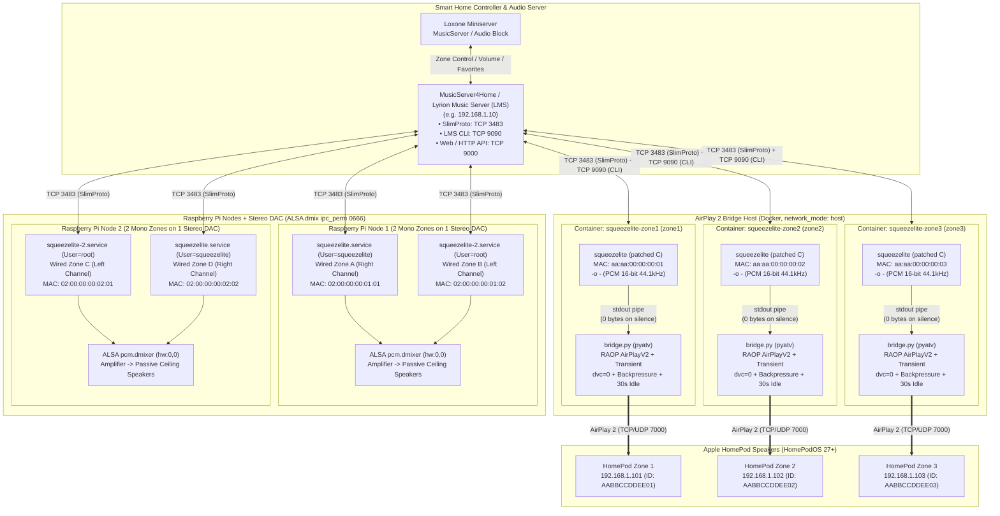

# Squeezelite to AirPlay 2 Bridge (HomePod OS 27+ & Loxone / LMS)

An audio bridge connecting **Lyrion Music Server (LMS) / MusicServer4Home (Loxone)** with **Apple HomePod speakers running HomePodOS 27+ (AirPlay 2)** using a custom-patched `squeezelite` binary (streaming raw PCM to `stdout` only during active playback) piped into an asynchronous Python bridge (`bridge.py`) powered by `pyatv`.

This repository also includes multi-zone ALSA `dmix` configurations for Raspberry Pi `squeezelite` nodes.

## System Architecture



### Step-by-Step Signal Flow
1. **Loxone Miniserver** sends playback or volume commands to **MusicServer4Home / LMS**.
2. **For Wired Zones (Raspberry Pi + HiFiBerry DAC+)**:
   - LMS streams audio via **SlimProto (TCP 3483)** directly to two independent `squeezelite` processes on each Raspberry Pi.
   - Using `ipc_perm 0666` in `/etc/asound.conf`, both processes mix their respective stereo channel (Left / Right) into a shared ALSA `pcm.dmixer` device on the DAC and feed the multi-channel amplifier and passive ceiling speakers.
3. **For Apple HomePod Zones (`zone1`, `zone2`, `zone3`)**:
   - LMS sees each Docker container as a standard `squeezelite` player over **TCP 3483**, while `bridge.py` maintains a persistent connection to the **LMS CLI (TCP 9090)**, enforcing `digitalVolumeControl 0` (100% bit-perfect digital volume) and listening for volume slider events.
   - During playback, the patched `squeezelite` binary writes raw 16-bit 44.1 kHz PCM frames to `stdout`, which `bridge.py` consumes and streams over an encrypted **AirPlay 2 (RAOP v2 on port 7000)** session to the target HomePod.
   - When playback pauses or stops, the patched `squeezelite` immediately stops writing bytes to `stdout` (`silence == true`). After 30 seconds of inactivity (`IDLE_TIMEOUT`), `bridge.py` tears down the AirPlay 2 session and releases the HomePod.

## Background & Upstream Bug Reports

Starting with **HomePodOS 27.0**, Apple HomePods silently drop audio sent over legacy AirPlay 1 (RAOP v1 / NTP timing), even though the RTSP session and RTP packet transmission appear to succeed in logs. Because the standard LMS AirPlay Bridge plugin (`squeeze2raop`) relies on AirPlay 1 via `libraop`, HomePods remain completely silent after the OS 27 update:

- **LMS Plugin (`philippe44/LMS-Raop`)**: [Issue #57 - HomePodOS 27.0: RAOP session succeeds and RTP audio is sent, but HomePods remain silent](https://github.com/philippe44/LMS-Raop/issues/57)
- **Underlying C Library (`philippe44/libraop`)**: [Issue #52 - Not working since IOS 27 on homepods](https://github.com/philippe44/libraop/issues/52)

This project replaces `squeeze2raop` for HomePod zones while keeping the exact same player names and MAC addresses in LMS / Loxone.

## Architecture & Key Fixes

### 1. Custom `squeezelite` Source Patches (`patches/`)
The multi-stage `Dockerfile` compiles `squeezelite` from Debian Bookworm sources with two C patches:
- **`patches/output_stdout.c`**:
  - In `_stdout_write_frames()`, skips writing zero-filled frames (`silencebuf`) when `silence == true` (paused, stopped, or powered off), returning `out_frames` immediately. As a result, `squeezelite` stops emitting bytes on `stdout` the instant playback stops, allowing `bridge.py` to detect inactivity without burning CPU scanning 160 MB/s of zero bytes, and cleanly close the AirPlay session after `IDLE_TIMEOUT` (30 s).
  - In `output_thread()`, adds `usleep(5000)` when the output buffer is empty (`buffill == 0`) to prevent a 100% CPU busy loop while idle.
- **`patches/output_alsa.c`**:
  - In `set_volume()`, locks internal digital gain to `FIXED_ONE` (100% / bit-perfect unity gain). Volume control is handled in hardware on the HomePod via the AirPlay 2 control channel (`sync_volume_lms`), avoiding double attenuation and preserving HomePod dynamic loudness/bass EQ.

### 2. Python AirPlay 2 Bridge (`bridge.py` + `pyatv`)
- **Explicit AirPlay 2 Capability Flags (`RAOP_AIRPLAY2_PROPS`)**:
  When multicast mDNS discovery does not return full TXT records inside Docker or across VLANs, `ManualService` is populated with explicit HomePod OS 27 capability flags (`ft=0x4A7FCA00,0x3C354BD0`, `et=0,3,5`, `cn=0,1,2,3`, `sf=0xb8404`, `ov=27.0`). Passing an empty `{}` properties dictionary causes `pyatv` (`get_protocol_version()` / `extract_credentials()`) to silently downgrade to unencrypted `AirPlayV1` (`AuthenticationType.Null`), which HomePodOS 27+ rejects.
- **`stdout` Backpressure During AirPlay 2 Handshake**:
  Because the patched `output_stdout.c` writes unthrottled whenever `buffill > 0`, `drain_squeezelite_stdout()` applies backpressure (`while self.running and not self.is_idle and len(self.audio_buffer) >= MAX_BUFFER_BYTES`) as soon as audio is detected (`not self.is_idle`), including during the ~0.8 s AirPlay 2 RTSP handshake before `self.is_streaming` flips to `True`. This prevents `squeezelite` from draining the entire track at CPU speed while connecting.
- **1.0 s `stdout` Read Timeout & 30 s Idle Teardown (`IDLE_TIMEOUT`)**:
  Wrapping `self.proc.stdout.read(4096)` in `asyncio.wait_for(..., timeout=1.0)` ensures the reader loop wakes up every second when `squeezelite` stops writing during pause/stop, checks `last_audio_time`, and closes the `pyatv` session after 30 seconds of silence so the HomePod is released.
- **Unity Digital Volume in LMS (`digitalVolumeControl 0`)**:
  On startup, `sync_volume_lms()` sends `<PLAYER_MAC> playerpref digitalVolumeControl 0` to the LMS CLI (port 9090) and forwards `mixer volume` changes directly to `atv.audio.set_volume()`.

## Usage (Docker Compose)

1. Copy `.env.example` to `.env` and fill in your LMS server IP, virtual player MAC addresses, and HomePod AirPlay IDs / IPs:
   ```bash
   cp .env.example .env
   ```
2. Build and start the containers:
   ```bash
   docker compose build
   docker compose up -d
   ```

## Raspberry Pi Multi-Zone ALSA `dmix` Setup (`raspberry-pi/`)

For Raspberry Pi nodes running two independent `squeezelite` instances on a single stereo DAC (`squeezelite.service` running as `User=squeezelite` on the right channel, and `squeezelite-2.service` running as `User=root` on the left channel):
1. Copy `raspberry-pi/asound.conf` to `/etc/asound.conf` (`ipc_perm 0666` on `pcm.dmixer` is required so both users can attach to the shared ALSA `dmix` IPC segment `ipc_key 1024` without `Permission denied`).
2. Specify an explicit MAC address (`-m <MAC>`) in `/etc/default/squeezelite` so the player never registers with `00:00:00:00:00:00` if started before the network interface is fully up.
3. Install `raspberry-pi/squeezelite-override.conf` as `/etc/systemd/system/squeezelite.service.d/override.conf` (`Restart=always`).
